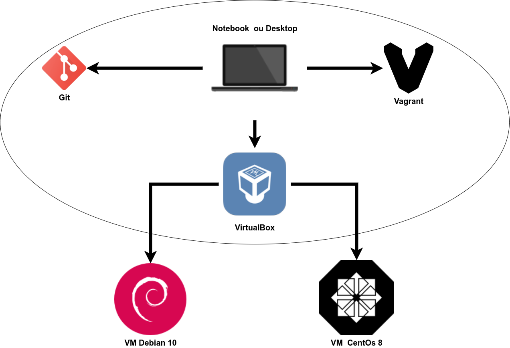

# LPIC-1 Linux Administrator

Este repositório é referente ao ambiente utilizado para praticar comandos e cenários com o objetivo de capacitação para a certificação LPIC-1 Linux Administrator.



Ao executar os passos de configuração, sua máquina, através do **Vagrant**, criará as máquinas virtuais no **VirtualBox** de forma automática. O **Vagrant** nos auxiliará a criar e gerenciar as máquinas de uma maneira muito mais simples e rápida do que se precisássemos instalá-las manualmente.

## Pré-requisitos

Para utilizar este repositório você deverá instalar o [Vagrant](https://www.vagrantup.com/) e o [VirtualBox](https://www.virtualbox.org/).

Para clonar o repositório você precisará do [git](https://git-scm.com/), para os usuários do Windows recomendamos [https://gitforwindows.org/](https://gitforwindows.org/).

## Configuração

Clone o repositório em algum diretório da sua máquina e inicie as vms:

```bash
git git clone https://github.com/fsvalim/lpic-1.git
cd hands-on
vagrant up
```

As máquinas serão provisionadas, este processo leva alguns minutos e depende da sua velocidade de conexão com a internet.

## Utilização

Todos os comandos devem ser utilizados dentro do diretório clonado.

Para listar as máquinas:

```bash
vagrant status
```

Para entrar em uma máquina:

```bash
vagrant ssh debian10
```

Para iniciar as máquinas:

```bash
vagrant up
```

Para desligar as máquinas:

```bash
vagrant halt
```
